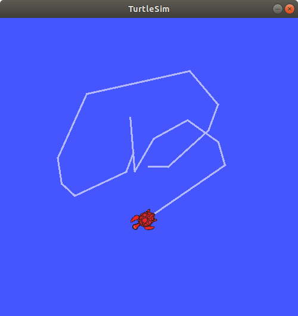

# Homework

1. 了解 Linux 系统:阅读《鸟哥的 Linux 私房菜》自学前三部分内容,或利用互联网进行学习,简答以下问题; <br>
  (1) 列举三个你常用的 Linux 命令,并说明他们的功能。<br>
  mkdir: 生成文件夹; cd: 进入其他目录； ls: 显示当前目录文件。<br>
  (2) 一句话简要介绍 Vim 的功能,如何在 Vim 中进行插入和删除,如何保存并退出 Vim?<br>
  Vim用来编辑文档，按i进入insert模式即可进行插入,在命令模式按x即可删除当前字，dd删除光标所在段，或者重新进入插入模式使用backspace删除,命令模式中按":"并输入"wq"回车即可退出Vim。<br>
  (3) 列举两种常用的 Linux 压缩和解压缩命令。<br>
  压缩: tar -zcv -f [压缩后文件名] [待压缩文件名]; 解压缩:  tar -zxv -f [待解压缩文件名] －C [解压缩目录]。

2. 了解 ROS:观看 ROS 免费公开课或前往 ROS 官网学习官方教程,安装好 ROS,提供运行小海龟跑的截图。

<p align="center">

</p>

3. 学习机器人姿态描述入门材料,完成坐标转换推导;
设机器人的世界坐标为 $x_a$ , $y_a$,其相对于世界坐标系的方向为 $θ_a$(右手坐标系)。假设机器人旁边有一物
体在世界坐标系下的位姿为($x_b , y_b , θ_b$ ),请问:<br>
(1)与巩固该物体相对于机器人的位置和朝向是什么,即该物体在当前机器人坐标系下的位姿是多少?<br>
<p align="center">

</p>
(2)与巩固机器人此时朝它的正前方(机器人坐标系 X 轴)行进了 d 距离,然后又转了 $θ_d$ 角,请问物体此时在
这一时刻机器人坐标系下的位姿是多少?
<p align="center">

</p>

1. 完成基础数学坐标转换的代码作业。

<p align="center">

</p>

```c++
#include <iostream>
#include <Eigen/Core>
#include <Eigen/Geometry>

using namespace std;

int main(int argc, char** argv)
{
    // 机器人B在坐标系O中的坐标：
    Eigen::Vector3d B(3, 4, M_PI);

    // 坐标系B到坐标O的转换矩阵：
    Eigen::Matrix3d TOB;
    TOB << cos(B(2)), -sin(B(2)), B(0),
           sin(B(2)),  cos(B(2)), B(1),
              0,          0,        1;

    // 坐标系O到坐标B的转换矩阵:
    Eigen::Matrix3d TBO = TOB.inverse();

    // 机器人A在坐标系O中的坐标：
    Eigen::Vector3d A(1, 3, -M_PI / 2);

    // 求机器人A在机器人B中的坐标：
    Eigen::Vector3d BA;

    // TODO 参照第一课PPT
    // start your code here (5~10 lines)
    Eigen::Matrix3d TOA;
    TOA << cos(A(2)), -sin(A(2)), A(0),
           sin(A(2)),  cos(A(2)), A(1),
              0,          0,        1;
    
    Eigen::Matrix3d TAO = TOA.inverse();
    Eigen::Matrix3d TBA = TBO * TOA;
    // end your code here
    BA << TBA(0,2), TBA(1,2), atan2(TBA(1,0),TBA(0,0));
    cout << "The right answer is BA: 2 1 1.5708" << endl;
    cout << "Your answer is BA: " << BA.transpose() << endl;

    return 0;
}
```


