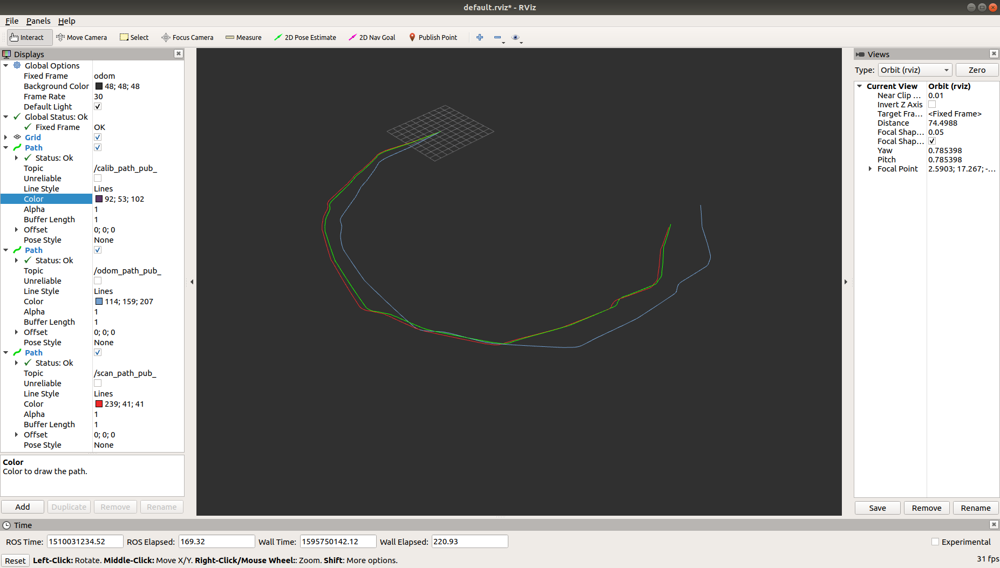
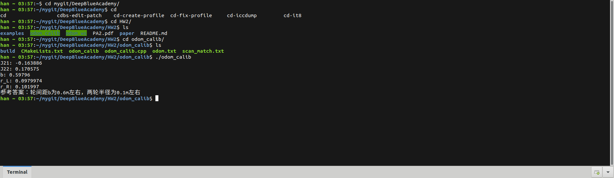

1. 补充直接线性方法的里程计标定模块代码;(6 分)  
    

        
    

    
2. 补充基于模型方法的里程计标定模块代码;(2 分)  
    

        
    

    

    
3. 通过互联网总结学习线性方程组 Ax=b 的求解方法,回答以下问题:(2 分)  
   
    (1)对于该类问题,你都知道哪几种求解方法?  
    (2)各方法的优缺点有哪些?分别在什么条件下较常被使用?  

    (1) 我知道使用2种方法，一种是线性最小二乘法，另一种是随机梯度下降法； 

    (2) 线性最小二乘法能保证得到最优解，但随着维度增大，计算越来越困难，而随机梯度下降法在限定迭代次数下不保证能得到最优解，但可以处理维度很大的情况，而且通过超参数可以增快学习速度。在维度低或者使用PCA等降维方法后，可以使用最小二乘法，在维度高的情况下使用随机梯度下降法。 

4. 简答题,开放性答案:设计里程计与激光雷达外参标定方法。(2 分)  

    我们一般把传感器内自身要调节的参数称为内参,比如前面作业中里程计模型的两轮间距与两个轮子的半径。把传感器之间的信息称为外参,比如里程计与激光雷达之间的时间延迟,位姿变换等。请你选用直接线性方法或基于模型的方法,设计一套激光雷达与里程计外参的标定方法,并回答以下问题:
    (1)你设计的方法是否存在某些假设?基于这些假设下的标定观测值和预测值分别是什么?
    (2)如何构建你的最小二乘方程组求解该外参?

    (1) 假设观测值和预测值之间存在线性关系，例如位姿变换，预测值为不同时间里程计数据积分的到的机器人坐标值，标定观测值为激光雷达计算得到的机器人位姿势。 

    (2) 假设:  
    
    

           &nbsp; 公式一
         
         
            &nbsp; 公式二        
         
         
    

    将旋转矩阵变换成向量形式,即可使用最小二乘方程组求解:

    

             &nbsp; 公式三        
    

    上下标: O: odom坐标系; L: 激光雷达坐标系; R为机械人每时刻的坐标系.

    就由公式一得到的 x11, x12, ... , x33 代入公式二即可得出位姿变换。