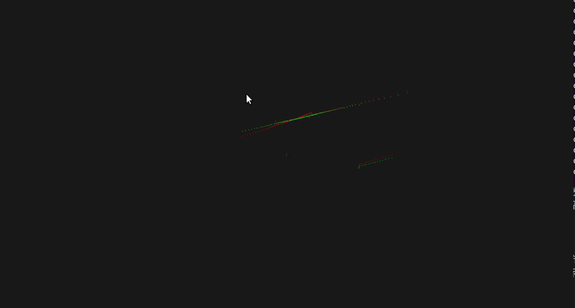

1. 补充去除激光雷达运动畸变模块的代码; <br>   
    
    去畸变效果如下:
    <p style="text-align:center">
        
    </p>
    
    代码中额外使用了Eigen库，假如编译失败请检查Eigen库的安装！

    <p style="text-align:center">
        LidarMotionUndistortion.cpp Line: 220 - 234
    </p>

    ```c++
    // 求Base在Odom坐标系下的位姿,及转换矩阵T(Base to Odom)
       double base_yaw = tf::getYaw(frame_base_pose.getRotation());
       tf::Vector3 base_XYZ = frame_base_pose.getOrigin();
       double base_x = base_XYZ.x();
       double base_y = base_XYZ.y();

       double cos_base = cos(base_yaw);
       double sin_base = sin(base_yaw);

       Eigen::MatrixXd Tob(3,3);
       Tob << cos_base, -sin_base, base_x, \
              sin_base, cos_base, base_y, \
              0 , 0, 1;
        
       Eigen::MatrixXd Tbo = Tob.inverse();
    ```

    <p style="text-align:center">
        Workspace Directory Structure
    <p>

    ```
    LaserUndistortion
    ├─── .vscpde
    |    ├── c_cpp_properties.json         # VScode ROS库配置
    |    └── settings.json 
    |
    ├─── .catkin_workspace
    ├─── bag                               # 数据集
    │    └─── ...    
    │   
    ├─── devel
    |    └─── ... 
    |
    └─── src
         ├─── champion_nav_msgs            # 自定义消息
         |    └── ...
         ├─── LaserUndistortion            # 作业代码
         |    └── ...
         └─── CMakeLists.txt      
    ```

2. 阅读论文 Least-Squares Fitting of Two 3-D Points Sets,推导并证明已知对应点的 ICP 求解方法; <br>
   
   首先有目标函数:
   <p style="text-align:center">
        
   <p>
    
    求旋转矩阵 R 使&nbsp;  最小，有:<br>
    <p style="text-align:center">
        
   <p>

    问题转化为求以下式的最大值:<br>

    <p style="text-align:center">
        
    <p>
    这里:
    <p style="text-align:center">
        
    <p>

    使用SVD:

    <p style="text-align:center">
        
    <p>

    当&nbsp;  &nbsp;时, 且&nbsp;  &nbsp;,有&nbsp;  &nbsp; 为最大值。

    因为有公理使&nbsp;  &nbsp; ，这里B也为任意旋转矩阵。
    
3. 阅读论文 Precise indoor localization for mobile laser scanner 前两章,回答问题。
   
    (1) 根据第二章内容,简述激光雷达测距原理;

    激光雷达测距原理主要有2种方法，一种是通过TOF (time-of-fight)，通过测量发出和接收激光时间之差来计算距离；另一种是测量相位差来计算距离，通过发出和接收幅值连续变化的光波，测量发出和接收时的相位差，计算距离。

    (2) 简要介绍一下右图的含义。<br>

    <p style="text-align:center">
        
    </p>

    图中为激光束测量4种不同情形的概率密度函数图，分别对应正常击中目标的高斯分布，碰到障碍物，radom noise, 和没有击中任何物体。

4. 简答题,开放性答案:设计使用 IMU 去除激光雷达运动畸变的方法并回答问题。<br>

    (1) 仅用 IMU 去除运动畸变可能会有哪些不足之处?<br>

    IMU 自身存在误差，并且会一直累计。

    (2) 在仅有 IMU 和激光雷达传感器的情况下,你会如何设计运动畸变去除方案(平移+旋转),达到较好的畸变去除效果?
    
    在运算资源充足的情况下结合ICP进行迭代匹配，此时可以合理假设 IMU 是线性误差，假设每dt后，IMU测量出现固定的角度误差和位移误差，即可使用ICP方法记性迭代直至收敛。