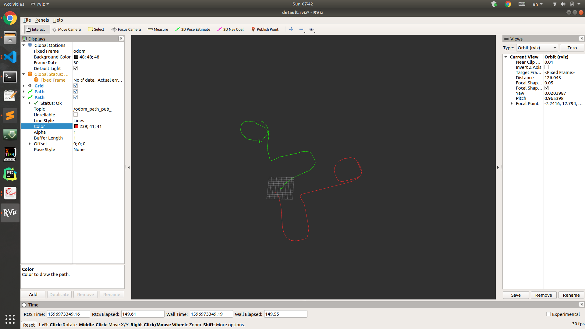
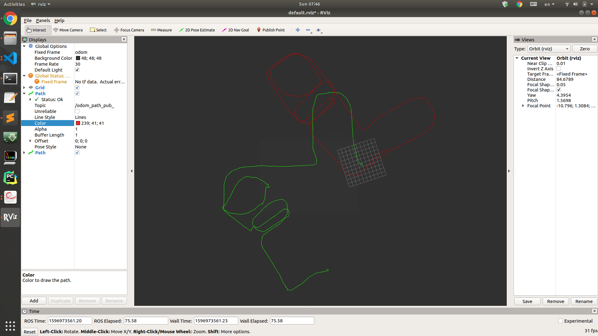

<p style="text-align:center; font-size:25px">
    README
<p>

1. catkin_make之后，在不同终端分别运行 roscore; rviz; 
2. 本次作业有两个代码需要实行,完成操作一后，在另一终端输入下面指令并回车，即可在rviz中观察IMLS-ICP的匹配情况;
```bash
rosrun imlsMatcher imlsMatcher_node
```
3. 完成操作一后，在另一终端输入下面指令并回车，即可在rviz中观察CSM库下PL-ICP的匹配情况;
```bash
rosrun imlsMatcher_csm imlsMatcher_csm_node
```

<br>

<p style="text-align:center; font-size:25px">
    REPORT
<p>

**1. 补充代码,实现两帧间的 IMLS-ICP 激光匹配;** <br>   
   
<p style="text-align:center">
    Code Snippet
<p>

```c++
    ///TODO
    //根据周围的激光点计算法向量，参考ppt中NICP计算法向量的方法
    Eigen::Vector2d ave_pos(0,0);
    for (auto &i: nearPoints){
        ave_pos += i; 
    }

    double point_num = nearPoints.size();  // Number of points
    ave_pos = ave_pos / point_num;

    Eigen::MatrixXd cov_mat(2,2);
    cov_mat.setZero();
    for (auto &i: nearPoints) {
        cov_mat = cov_mat + (i - ave_pos) * (i - ave_pos).transpose();
    }
    cov_mat = cov_mat / point_num;

    Eigen::EigenSolver<Eigen::Matrix2d> e_s(cov_mat);   // Using eigensolver to diagonalize
    Eigen::Matrix2d dia_mat = e_s.pseudoEigenvalueMatrix();
    Eigen::Matrix2d vec_mat = e_s.pseudoEigenvectors();

    int index = dia_mat(0,0) > dia_mat(1,1)? 1 : 0;  // Normal vectrol corresponds to the least eigen value
    normal = vec_mat.col(index);
    //end of TODO
```

```c++
    //TODO
    //根据函数进行投影．计算height，即ppt中的I(x)
    double weight(0.0);
    double weight_sum(0.0);
    height = 0;
    Eigen::Vector2d temp;
    for (size_t i = 0; i < nearPoints.size(); i++ ){
        temp = x - nearPoints[i];
        weight = exp(-(temp(0)*temp(0)+temp(1)*temp(1))/(m_h*m_h));
        height += weight*temp.dot(nearNormals[i]);
        weight_sum += weight;
    }
    height /= weight_sum;
    //end of TODO
```

```c++
    //TODO
    //计算yi．
    yi = xi - height * nearNormal;  // xi in fact is xi prime
    //end of TODO
```

<p style="text-align:center; font-size:15px">
 <br>
fig.1 不使用csm库的 IMLS-ICP 激光匹配情景
</p>

<br>

**2. 将第一题 IMLS-ICP 匹配的接口换成第二次作业中 CSM 库的 ICP 匹配接口,并生成激光匹配的轨迹;** <br>

代码与上一题结构相似，唯一不同在于第二题调用了CSM库对帧间点云进行匹配，并计算位姿。

<p style="text-align:center">
    Code Snippet
<p>

```c++
    void SetPIICPParams(){   // Parameters to use CSM PI-ICP (sm_params)
        //设置激光的范围      
        m_PIICPParams.min_reading = 0.1;
        m_PIICPParams.max_reading = 20;

        //设置位姿最大的变化范围
        m_PIICPParams.max_angular_correction_deg = 20.0;
        m_PIICPParams.max_linear_correction = 1;

        //设置迭代停止的条件
        m_PIICPParams.max_iterations = 50;
        m_PIICPParams.epsilon_xy = 0.000001;
        m_PIICPParams.epsilon_theta = 0.0000001;

        //设置correspondence相关参数
        m_PIICPParams.max_correspondence_dist = 1;
        m_PIICPParams.sigma = 0.01;
        m_PIICPParams.use_corr_tricks = 1;

        //设置restart过程，因为不需要restart所以可以不管
        m_PIICPParams.restart = 0;
        m_PIICPParams.restart_threshold_mean_error = 0.01;
        m_PIICPParams.restart_dt = 1.0;
        m_PIICPParams.restart_dtheta = 0.1;

        ...
```

```c++
    void championLaserScanCallback(const champion_nav_msgs::ChampionNavLaserScanConstPtr& msg)
    {
        if(m_isFirstFrame == true)
        {
            std::cout <<"First Frame"<<std::endl;
            m_isFirstFrame = false;
            m_prevLaserPose = Eigen::Vector3d(0, 0, 0);
            pubPath(m_prevLaserPose, m_imlsPath, m_imlsPathPub);
            ConvertChampionLaserScanToEigenPointCloud(msg, m_prevLDP);
            return ;
        }

        std::vector<Eigen::Vector2d> nowPts;  // 替换成ldp
        LDP m_curLDP;
        ConvertChampionLaserScanToEigenPointCloud(msg, m_curLDP);

        m_prevLDP->odometry[0] = 0.0;
        m_prevLDP->odometry[1] = 0.0;
        m_prevLDP->odometry[2] = 0.0;

        m_prevLDP->estimate[0] = 0.0;
        m_prevLDP->estimate[1] = 0.0;
        m_prevLDP->estimate[2] = 0.0;

        m_prevLDP->true_pose[0] = 0.0;
        m_prevLDP->true_pose[1] = 0.0;
        m_prevLDP->true_pose[2] = 0.0;

        //设置匹配的参数值
        m_PIICPParams.laser_ref = m_prevLDP;
        m_PIICPParams.laser_sens = m_curLDP;

        if (m_imlsPath.poses.size() > 1){
            int last_index = m_imlsPath.poses.size() - 2;
            int cur_index = m_imlsPath.poses.size() - 1;
            geometry_msgs::PoseStamped last_pose_stamped = m_imlsPath.poses[last_index];
            geometry_msgs::PoseStamped cur_pose_stamped = m_imlsPath.poses[cur_index];

            double last_x = last_pose_stamped.pose.position.x;
            double last_y = last_pose_stamped.pose.position.y;
            double last_orient = tf::getYaw(last_pose_stamped.pose.orientation);
            double cur_x = cur_pose_stamped.pose.position.x;
            double cur_y = cur_pose_stamped.pose.position.y;
            double cur_orient = tf::getYaw(cur_pose_stamped.pose.orientation);
            
            Eigen::MatrixXd T_wn(3,3);
            Eigen::MatrixXd T_wl(3,3);
            Eigen::MatrixXd T_ln(3,3);
            T_wl << cos(last_orient) , -sin(last_orient) , last_x
                    , sin(last_orient) , cos(last_orient) , last_y
                    , 0 , 0 , 1;
            T_wn << cos(cur_orient) , -sin(cur_orient) , cur_x
                    , sin(cur_orient) , cos(cur_orient) , cur_y
                    , 0 , 0 , 1;

            T_ln =  T_wl.inverse() * T_wn;
            m_PIICPParams.first_guess[0] = T_ln(0,2);
            m_PIICPParams.first_guess[1] = T_ln(1,2);
            m_PIICPParams.first_guess[2] = atan2(T_ln(1,0),T_ln(0,0));
        }
        else{
            m_PIICPParams.first_guess[0] = 0.00115598;
            m_PIICPParams.first_guess[1] = -0.000150684;
            m_PIICPParams.first_guess[2] = -0.00857492 / 180 * M_PI;
        }
        m_OutputResult.cov_x_m = 0;
        m_OutputResult.dx_dy1_m = 0;
        m_OutputResult.dx_dy2_m = 0;

        sm_icp(&m_PIICPParams,&m_OutputResult);

        //nowPose在lastPose中的坐标
        Eigen::Vector3d rPose;
        if (m_OutputResult.valid) {
            rPose(0) = (m_OutputResult.x[0]);
            rPose(1) = (m_OutputResult.x[1]);
            rPose(2) = (m_OutputResult.x[2]);

            //        std::cout <<"Iter:"<<m_OutputResult.iterations<<std::endl;
            //        std::cout <<"Corr:"<<m_OutputResult.nvalid<<std::endl;
            //        std::cout <<"Erro:"<<m_OutputResult.error<<std::endl;

            //        std::cout <<"PI ICP GOOD"<<std::endl;
        } else {
            std::cout << "PI ICP Failed!!!!!!!" << std::endl;
            rPose << 0.00115598, -0.000150684, -0.00857492 / 180 * M_PI ;
        }

        Eigen::Matrix3d lastPose;
        lastPose << cos(m_prevLaserPose(2)), -sin(m_prevLaserPose(2)), m_prevLaserPose(0),
                    sin(m_prevLaserPose(2)), cos(m_prevLaserPose(2)), m_prevLaserPose(1),
                    0, 0, 1;

        Eigen::Matrix3d rPose_mat;
        rPose_mat << cos(rPose(2)), -sin(rPose(2)), rPose(0),
                    sin(rPose(2)), cos(rPose(2)), rPose(1),
                    0, 0, 1;
         
        Eigen::Matrix3d nowPose = lastPose * rPose_mat;
        m_prevLaserPose << nowPose(0, 2), nowPose(1, 2), atan2(nowPose(1,0), nowPose(0,0));
        pubPath(m_prevLaserPose, m_imlsPath, m_imlsPathPub);

        m_prevLDP = m_curLDP;
    }
```

<p style="text-align:center; font-size:15px">
 <br>
fig.1 使用csm库的 PL-ICP 激光匹配情景
</p>

<br>
    
**3. 阅读 ICP 相关论文,总结课上所学的几种 ICP 及其相关变型并简述其异同(ICP,PL-ICP,NICP,IMLS-ICP);** <br>

相同点: <br>
* 都通过设计目标函数，并通过迭代得到收敛。<br>

不同点:
* **ICP**: ICP为点对点进行匹配,效果比较差，目标函数根据点与点的距离设计。<br>
* **PL-ICP**: PL-ICP为点到线的距离作为误差；PL-ICP的误差形式更符合实际情况；收敛速度相比于 ICP 更快，是二阶收敛；PL-ICP的求解精度高于ICP,特别是在结构化环境中；PL-ICP 对初始值更敏感；不单独使用，与里程、CSM等一起使用。但是对于初始值更加敏感，不单独使用，与里程计，CSM 等一起使用。<br>
* **NICP**: 计算点所在平面的曲率和法向量, 进而筛选掉不符合匹配条件的点， 使迭代中要考虑的点更少，提高了效率；在误差定义中,除了考虑欧氏距离之
外,还考虑了法向量之间的距离。<br>
* **IMLS-ICP**: 选择具有代表性的激光点来进行匹配，既能减少计算量同时又能减少激光点分布不均匀导致的计算结果出现偏移；计算点到点云代表的隐藏曲面的距离,计算一个对应的点来进行匹配；计算量比之前的方法都要大，目标函数根据点与其对应隐藏曲面的距离设计。<br>

<br>

**4. 简答题,开放性答案：现在你已经了解了多种 ICP 算法，你是否也能提出一种改进的 ICP 算法，或能提升 ICP 总体匹配精度或速度的技巧?请简述你的改进策略。** <br>

计算力和储存容量越来越高的情况下，使用类似图优化的方法配合IMLS-ICP进行点云与曲面的配对，我们在机械人行进过程中保存明显特征的曲面，然后通过点云与曲面的配对估计位姿，我觉得这样能一定程度上提高匹配精度。


<br>

<br>

<p style="text-align:center; font-size:25px">
    Workspace Directory Structure
<p>

    ```
    imlsMatcherProject
    ├─── .vscpde
    |    ├── c_cpp_properties.json         # VScode ROS库配置
    |    └── settings.json 
    |
    ├─── .catkin_workspace   
    ├─── devel
    |    └─── ... 
    |
    └─── src
         ├─── champion_nav_msgs            # 自定义消息
         |    └── ...
         ├─── imlsMatcher                  # 不使用CSM库的imls-icp代码
         |    └── ...
         ├─── LaserUndistortion            # 使用CSM库的pl-icp代码
         |    └── ...
         ├─── bag
         |    └── ...                      #数据集
         └─── CMakeLists.txt      
    ```