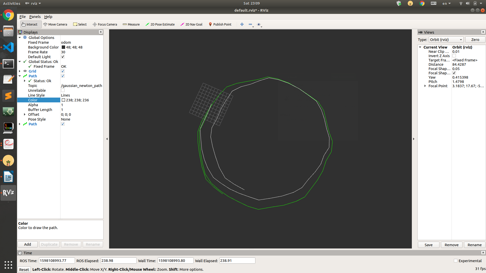
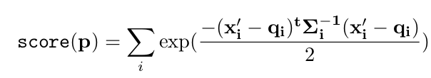
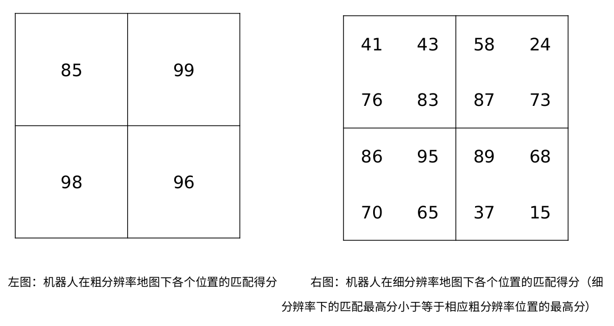

<p style="text-align:center; font-size:25px">
    README
<p>

1. catkin_make之后，在不同终端分别运行 roscore; rviz;
2. 在第三个终端运行 rosrun 运行 gaussian_newton_node; 随后使用 rosbag 播放 odom.bag 并在 rviz 中观察里程计与 Laser Scan Matching 生成的两条轨迹运行情况;

```bash
## terminal 1
roscore
```
```bash
## terminal 2
rviz
```
```bash
## terminal 3
rosrun gaussian_newton_scanmatcher gaussian_newton_node
```
```bash
## terminal 4
rosbag play --clock odom.bag
```

<br>

<p style="text-align:center; font-size:25px">
    REPORT
<p>

**1. 补充代码,实现 gaussian_newton_scanmatcher 模块;** <br>   

在 vscode 编译的时候发现 gaussian_newton_method.cpp 中引用的是 ros 中的 map.h, 为了方便，将 map.h 外的尖括号换成双引号.

```c++
// 地图插值

Eigen::Vector3d InterpMapValueWithDerivatives(map_t* map,Eigen::Vector2d& coords)
{
    Eigen::Vector3d ans;
    //TODO
    double x_true = coords(0);
    double y_true = coords(1);

    int x_floor = (int)x_true;
    int y_floor = (int)y_true;

    double x_prime = x_true - x_floor;     // 数值稳定性
    double y_prime = y_true - y_floor;

    double Z_00 = map->cells[MAP_INDEX(map, x_floor, y_floor)].score;
    double Z_10 = map->cells[MAP_INDEX(map, (x_floor+1), y_floor)].score;
    double Z_11 = map->cells[MAP_INDEX(map, (x_floor+1), (y_floor+1))].score;
    double Z_01 = map->cells[MAP_INDEX(map, x_floor, (y_floor+1))].score;
    
    double x_prime_minus = 1.0 - x_prime; 
    double y_prime_minus = 1.0 - y_prime;

    double L = y_prime*(x_prime*Z_11 + x_prime_minus*Z_01) + y_prime_minus*(x_prime*Z_10 + x_prime_minus*Z_00);
    double dl_dx = (y_prime*(Z_11-Z_01) + y_prime_minus*(Z_10-Z_00))/map->resolution;
    double dl_dy = (x_prime*Z_11 + x_prime_minus*Z_01 - x_prime* Z_10 - x_prime_minus*Z_00)/map->resolution;
    // Divide by resolution -> from map derivative to actual derivative


    ans << L, dl_dx, dl_dy;
    //END OF TODO

    return ans;
}
```

```c++
// 计算海信矩阵H 及 H* \Delta{T}

void ComputeHessianAndb(map_t* map, Eigen::Vector3d now_pose,
                        std::vector<Eigen::Vector2d>& laser_pts,
                        Eigen::Matrix3d& H, Eigen::Vector3d& b)
{
    H = Eigen::Matrix3d::Zero();
    b = Eigen::Vector3d::Zero();

    //TODO
    Eigen::Matrix3d mat_rotate;
    double c = cos(now_pose(2));
    double s = sin(now_pose(2));

    mat_rotate << c, -s, now_pose(0),
                  s, c,  now_pose(1),
                  0, 0,  1;

    for (auto pts: laser_pts){

        Eigen::Vector3d laser_pose;
        laser_pose << pts(0), pts(1), 1;
        laser_pose = mat_rotate * laser_pose;

        double cell_x = (laser_pose[0] - map->origin_x) / map->resolution + double(map->size_x / 2);    
        double cell_y = (laser_pose[1] - map->origin_y) / map->resolution + double(map->size_y / 2);
        // actual laser coord -> map cell coord

        Eigen::Vector2d S_coord(cell_x, cell_y);

        Eigen::Vector3d M = InterpMapValueWithDerivatives(map,S_coord);

        Eigen::Vector2d delta_M(M(1),M(2));

        Eigen::MatrixXd dS_dT(2,3);
        dS_dT << 1, 0, -s*pts(0)-c*pts(1),
                 0, 1, c*pts(0)-s*pts(1);

        Eigen::MatrixXd temp = delta_M.transpose()*dS_dT;
        H = H + temp.transpose()*temp;
        b = b + temp.transpose()*(1-M(0));
    }
    //END OF TODO
}
```

```c++
// 高斯牛顿优化，不断迭代直到达到最大迭代次数

void GaussianNewtonOptimization(map_t*map,Eigen::Vector3d& init_pose,std::vector<Eigen::Vector2d>& laser_pts)
{
    int maxIteration = 20;
    Eigen::Vector3d now_pose = init_pose;

    for(int i = 0; i < maxIteration;i++)
    {
        //TODO
        Eigen::Vector3d delta_pose;
        Eigen::Matrix3d H; 
        Eigen::Vector3d b;

        ComputeHessianAndb(map, now_pose, laser_pts, H, b);
        delta_pose = H.inverse()*b;
        now_pose = now_pose + delta_pose;
        //END OF TODO
    }
    init_pose = now_pose;

}
```


<p style="text-align:center; font-size:15px">
    运行截图<br>
    
<p>

<br>

**2. 简答题,开放性答案:提出一种能提升第一题激光匹配轨迹精度的方法,并解释原因;** <br>   

使用 VICP 中用里程计去除激光运动畸变的方法，再使用高斯牛顿优化方法对激光进行配对，我觉得这样可以提高精度；但同时也会增加计算量.

<br>

**3. 阅读论文 The Normal Distributions Transform: A New Approach to Laser Scan Matching , 回答以下问题:** <br>

(1) NDT 的优化函数(score)是什么?

<p style="text-align:center; font-size:25px">
    
<p>

公式中的 ${x}'_i$ 代表经过坐标变换后的激光点坐标, $q_i$ 与 $\Sigma_i$ 分表代表当前激光点所在分布的平均值与协方差.

(2) 简述 NDT 根据 score 函数进行优化求解的过程。

在论文中主要分为7步: <br>
1. 使用第一次的激光结果生成NDT;
2. 初始化预测的参数(使用0或者使用里程计数据进行初始化);
3. 将坐标转换后的当前激光点映射到NDT的坐标框架中;
4. 确定每个激光点所处的正态分布;
5. 使用对应的正态分布参数计算每个点的分数并累加;
6. 使用牛顿法更新位姿;
7. 回到第三步继续迭代直到达到收敛的条件.

<br>

**4. 机器人在 XY 方向上进行 CSM 匹配。下图左为机器人在目标区域粗分辨率下 4 个位置的匹配得分,得分越高说明机器人在该位置匹配的越好,下图右为机器人在同一块地图细分辨率下每个位置的匹配得分(右图左上 4 个小格对应左图左上一个大格,其它同理)。如果利用分枝定界方法获取最终细分辨率下机器人的最佳匹配位置,请简述匹配和剪枝流程。** <br>

<p style="text-align:center; font-size:25px">
    
<p>

* 初始化 best_score 为 INTMIN;
* 首先遍历root下面的4个branch, 并从大到小放进stack, 此时 stack 中元素分别为 {99, 98, 96, 85};
* 首先清除(pop) 99, 并遍历其子节, 以从大到小的顺序放进stack, 此时 stack 中的元素分别为 {87, 73, 58, 24, 98, 96, 85};
* 继续遍历 stack, 清除87, 87 为 leaf node, 且 $87 > INTMIN$ , best_score 更新为87;
* 依次遍历并清除73, 58, 24, 因为这些节点皆小于87, 所以 continue;
* 此时遍历到98, 因为 $98 > 87$, 遍历其子节点, 并以从大到小的顺序加入 stack，此时 stack 中的元素分别为 {95, 86, 70, 65, 96, 85};
* 遍历至95, 显然95为 leaf node, 且 $95 > 87$, best_score 更新为95;
* 依次遍历并清除86, 70, 65, 因为这些节点皆小于95, 所以 continue;
* 此时遍历到96, 因为 $96 > 95$, 遍历其子节点, 并以从大到小的顺序加入 stack, 此时 stack 中的元素分别为 {89, 68, 37, 15, 85};
* 依次遍历并清除89, 68, 37, 15, 因为这些节点皆小于95, 所以 continue;
* 此时遍历到85, 因为 $85 < 95$, 直接 continue, 此时 stack 为空, 遍历结束;
* 得到 best_score 为95; 


<br>

<br>

<p style="text-align:center; font-size:25px">
    Workspace Directory Structure
<p>

    ```
    gaussian_newton_ws
    ├─── .vscpde
    |    ├── c_cpp_properties.json         # VScode ROS库配置
    |    └── settings.json 
    |
    ├─── .catkin_workspace   
    ├─── devel
    |    └─── ... 
    |
    ├─── build
    |    └─── ... 
    |
    ├─── src
    |    ├─── gaussian_newton_scanmatcher  # 基于高斯牛顿优化方法的激光配对代码
    |    |    └── ...
    |    └─── CMakeLists.txt    
    |  
    └─── bag
         ├─── odom.bag                     # 数据包
         └─── topics.yaml                  # 捉取下来的 odom 数据表格
    ```
